💫 About Me

🌱 Currently working on: Building full-stack projects and strengthening core CS concepts

🤝 Looking to collaborate on: Web development projects and open-source contributions

🛠️ Looking for help with: DSA, backend architecture, and real-world project ideas

📚 Currently learning: React, Node.js, databases, and system design basics

💬 Ask me about: C/C++, Python, DSA, and web development

⚡ Fun fact: I enjoy solving problems and turning ideas into working applications 🚀

---

🌐 Socials

---

💻 Tech Stack

Languages

Frontend

Backend & Databases

Data Science & ML

Tools

---

📊 GitHub Stats

  
    
    

  
---

🏆 GitHub Trophies

---

✍️ Random Dev Quote

---

🔝 Top Contributed Repositories

---

. See this
